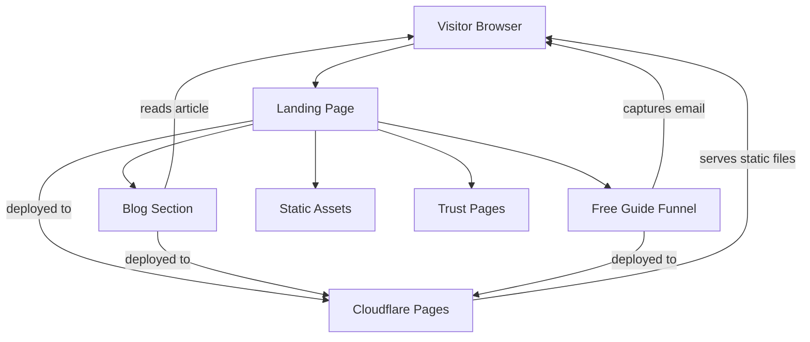

# Blueprint: savvautops/sockthedoc-site

_Auto-generated architectural documentation — 2026-09-24 (Phase 1). Built from the repository file tree, README and manifests._

## Diagram

## How it works

SockTheDoc is a fully static marketing and content site for the SockTheDoc health and fitness brand — no backend, no build step, no database. Every page is a plain HTML file styled by a single shared stylesheet, deployed to Cloudflare Pages where each push to `main` goes live automatically.

Traffic lands on `index.html`, which funnels visitors toward two goals: reading SEO-targeted blog articles (sleep hygiene, morning routines, weight habits) and claiming the free PDF health guide. The free-guide section acts as the lead magnet — the page visitors hit before an email capture or download step. Affiliate links are embedded in the content as the monetization layer.

Trust and compliance pages (`about.html`, `disclosure.html`, `privacy.html`) satisfy affiliate disclosure requirements and the Pinterest API application (which demands a real site with a public privacy policy). `sitemap.xml` and `robots.txt` handle search engine indexing.

## Key files

- `index.html` — landing page and primary traffic entry point
- `styles.css` — the single shared stylesheet for the whole site
- `blog/` — SEO article pages (sleep, back pain, weight habits)
- `blog/index.html` — blog listing page
- `free-guide/index.html` — lead-magnet funnel page
- `disclosure.html` / `privacy.html` — affiliate disclosure and privacy policy (Pinterest API requirement)
- `sitemap.xml` / `robots.txt` — search indexing

## For the owner

This is your SockTheDoc website — a simple, fast set of web pages with no moving backend parts. Visitors arrive, read health articles, and grab your free guide; affiliate links inside the content earn the revenue. Because it is all static files on Cloudflare Pages, hosting is free and publishing is just pushing to GitHub. The disclosure and privacy pages are not filler — they are what unblock the Pinterest developer API application.
